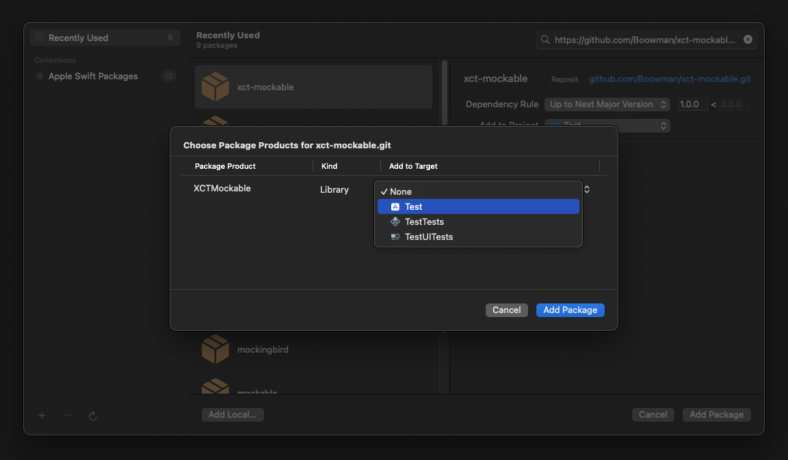

# XCTMockable

<div>
    <a href="https://github.com/Boowman/xct-parameterize"></a>
    <a href="https://www.swift.org/"></a>
    <a href="https://developer.apple.com/xcode/"></a>
    <a href="https://github.com/Boowman/xct-Parameterize?tab=MIT-1-ov-file"></a>
</div>

## Table of contents

- [Summary](https://github.com/Boowman/xct-mockable?tab=readme-ov-file#summary)
- [Requirements](https://github.com/Boowman/xct-mockable?tab=readme-ov-file#requirements)
- [Installation](https://github.com/Boowman/xct-mockable?tab=readme-ov-file#installation)
    - [SPM](https://github.com/Boowman/xct-mockable?tab=readme-ov-file#swift-package-manager)
    - [Package](https://github.com/Boowman/xct-mockable?tab=readme-ov-file#adding-it-to-a-package)
- [Examples without the package](https://github.com/Boowman/xct-mockable?tab=readme-ov-file#examples-reason-why-we-need-it)
- [Examples using the package](https://github.com/Boowman/xct-mockable?tab=readme-ov-file#examples-how-to-use-xctMockable)

## Summary

...

## Requirements

Xcode 15 or above
Swift 5.9 or later

## Installation

#### Swift Package Manager

1. In Xcode, navigate in menu: File > Swift Packages > Add Package Dependency
2. Add `https://github.com/Boowman/xct-mockable.git`
3. For the Dependency Rule, Select "Up to Next Major" with `1.0.0`. Click Add Package.
4. Under `Package Product` look for XCTMockable and under `Target` select your test target.
5. Click Add Package.

<p align="left">
    
</p>

#### Adding it to a package

1. In `Package.swift` add:

``` swift
    dependencies: [
        ...
      .package(url: "https://github.com/Boowman/xct-mockable", branch: "1.0.0")
    ]
```

2. Add the product to your target again inside `Package.swift`

```swift
    .target(
        name: <Your Target>,
        dependencies: [
            ...
            .product(name: "XCTMockable", package: "XCTMockable"),
        ]
    )
```

## Examples [Reason why we need it]

## Support

<table>
  <tr>
    <th width="400px"></th>
    <th width="150px">XCTMockable</th>
  </tr>
  <tr>
    <td width="400px">Protocol Mocks</td>
    <td width="150px">✅</td>
  </tr>
  <tr>
    <td width="400px">Class Mocks</td>
    <td width="150px">❌</td>
  </tr>
</table>

<table>
  <tr>
    <th width="400px"></th>
    <th width="150px"></th>
  </tr>
  <tr>
    <td width="400px">Protocol Inheritance</td>
    <td width="150px">❌</td>
  </tr>
  <tr>
    <td width="400px">Class Inheritance</td>
    <td width="150px">❌</td>
  </tr>
  <tr>
    <td width="400px">External Type Inheritance</td>
    <td width="150px">❌</td>
  </tr>
</table>

<table>
  <tr>
    <th width="400px"></th>
    <th width="150px"></th>
  </tr>
  <tr>
    <td width="400px">Annotated Protocols</td>
    <td width="150px">✅</td>
  </tr>
  <tr>
    <td width="400px">Attributes Methods</td>
    <td width="150px">✅</td>
  </tr>
</table>

<table>
  <tr>
    <th width="400px"></th>
    <th width="150px"></th>
  </tr>
  <tr>
    <td width="400px">Method</td>
    <td width="150px">✅</td>
  </tr>
  <tr>
    <td width="400px">Properties</td>
    <td width="150px">✅</td>
  </tr>
  <tr>
    <td width="400px">Subscripts</td>
    <td width="150px">✅</td>
  </tr>
  <tr>
    <td width="400px">Static Methods</td>
    <td width="150px">✅</td>
  </tr>
  <tr>
    <td width="400px">Static Properties</td>
    <td width="150px">✅</td>
  </tr>
  <tr>
    <td width="400px">Async Properties</td>
    <td width="150px">❌</td>
  </tr>
  <tr>
    <td width="400px">Async Throws Properties</td>
    <td width="150px">❌</td>
  </tr>
  <tr>
    <td width="400px">Async Methods</td>
    <td width="150px">✅</td>
  </tr>
  <tr>
    <td width="400px">Async Throws Methods</td>
    <td width="150px">✅</td>
  </tr>
  <tr>
    <td width="400px">Throws Methods</td>
    <td width="150px">✅</td>
  </tr>
  <tr>
    <td width="400px">Attributes</td>
    <td width="150px">✅</td>
  </tr>
  <tr>
    <td width="400px">Self</td>
    <td width="150px">✅</td>
  </tr>
</table>

<table>
  <tr>
    <th width="400px"></th>
    <th width="150px"></th>
  </tr>
  <tr>
    <td width="400px">Stub Return Value</td>
    <td width="150px">✅</td>
  </tr>
  <tr>
    <td width="400px">Stub Throwing Errors</td>
    <td width="150px">❌</td>
  </tr>
  <tr>
    <td width="400px">Stub Parameterised Methods</td>
    <td width="150px">✅</td>
  </tr>
  <tr>
    <td width="400px">Variadic Parameters</td>
    <td width="150px">✅</td>
  </tr>
  <tr>
    <td width="400px">Stub Inout Parameters</td>
    <td width="150px">❌</td>
  </tr>
  <tr>
    <td width="400px">Stub Sequences</td>
    <td width="150px">❌</td>
  </tr>
</table>

<table>
  <tr>
    <th width="400px"></th>
    <th width="150px"></th>
  </tr>
  <tr>
    <td width="400px">Nested Classes</td>
    <td width="150px">❌</td>
  </tr>
  <tr>
    <td width="400px">Type Aliasing</td>
    <td width="150px">❌</td>
  </tr>
  <tr>
    <td width="400px">Fully-Qualified Types</td>
    <td width="150px">❌</td>
  </tr>
  <tr>
    <td width="400px">Compilation Conditions</td>
    <td width="150px">❌</td>
  </tr>
</table>

<table>
  <tr>
    <th width="400px"></th>
    <th width="150px"></th>
  </tr>
  <tr>
    <td width="400px">Extract Argument Matching</td>
    <td width="150px">❌</td>
  </tr>
  <tr>
    <td width="400px">Wildcard Argument Matching</td>
    <td width="150px">❌</td>
  </tr>
</table>

<table>
  <tr>
    <th width="400px"></th>
    <th width="150px"></th>
  </tr>
  <tr>
    <td width="400px">Relaxed Mocks</td>
    <td width="150px">❌</td>
  </tr>
  <tr>
    <td width="400px">In Order Verification</td>
    <td width="150px">❌</td>
  </tr>
  <tr>
    <td width="400px">Asynchronous Verification</td>
    <td width="150px">❌</td>
  </tr>
  <tr>
    <td width="400px">Thread-Safe Testing</td>
    <td width="150px">❌</td>
  </tr>
  <tr>
    <td width="400px">Argument Capturing</td>
    <td width="150px">❌</td>
  </tr>
</table>

<table>
  <tr>
    <th width="400px"></th>
    <th width="150px"></th>
  </tr>
  <tr>
    <td width="400px">Primitive Types</td>
    <td width="150px">✅</td>
  </tr>
  <tr>
    <td width="400px">Nullable Types</td>
    <td width="150px">✅</td>
  </tr>
  <tr>
    <td width="400px">Custom Objects</td>
    <td width="150px">✅</td>
  </tr>
  <tr>
    <td width="400px">Array</td>
    <td width="150px">✅</td>
  </tr>
  <tr>
    <td width="400px">Async</td>
    <td width="150px">✅</td>
  </tr>
  <tr>
    <td width="400px">Throws</td>
    <td width="150px">✅</td>
  </tr>
  <tr>
    <td width="400px">Async Throws</td>
    <td width="150px">✅</td>
  </tr>
  <tr>
    <td width="400px">Async Throws Type</td>
    <td width="150px">✅</td>
  </tr>
</table>

